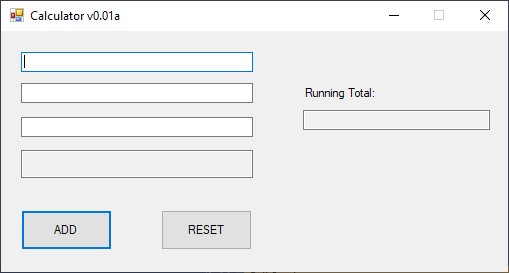

Related project(s):
[SampleMVP](https://github.com/astrohart/SampleMVP)

# xyLOGIX.Queues.Messages

Component libraries:

* [xyLOGIX.Queues.Messages](https://github.com/astrohart/xyLOGIX.Queues.Messages/tree/master/xyLOGIX.Queues.Messages)
* [xyLOGIX.Queues.Messages.Events](https://github.com/astrohart/xyLOGIX.Queues.Messages/tree/master/xyLOGIX.Queues.Messages.Events)
* [xyLOGIX.Queues.Messages.Interfaces](https://github.com/astrohart/xyLOGIX.Queues.Messages/tree/master/xyLOGIX.Queues.Messages.Interfaces)
* [xyLOGIX.Queues.Messages.Models](https://github.com/astrohart/xyLOGIX.Queues.Messages/tree/master/xyLOGIX.Queues.Messages.Models)

## Introduction

This project is a collection of C# class libraries -- that I hope to combine into a NuGet package some day -- which implement a very simple version of the Event Aggregator pattern.

I am heavily experienced in C++/MFC/Win32 and, as such, I sought to emulate the way the Microsoft Foundation Class Library implements event aggregation (while I do not know for 100% sure, I suspect that the so-called "message maps" are MFC's way of, basically, more or less, doing event aggregation of Windows operating system messages) on a very microcosm level in C#.

### Motiviation

The idea sprang from my working in a recent project where I had a service object being called by a WinForms Presenter (using MVP pattern). The service object exposed numerous C# `event`s that served as callbacks for various phases of the actions of the service object.

A difficulty arose because one component of the application needed to respond to events raised by another component.  The two components did not have direct access to references of each other, so C# `event` delegates were not so useful in this particular case.

The case to be made against C# `event` delegate use is the following:

* (a) These constructs force objects to be more tightly-coupled;
* (b) No one else but the object who actually has the dependency can respond to events raised by the service object.
* (c) Some of the events were ones that the client(s) of the containing object, or objects elsewhere in the application, for that matter, might also be interested in.

This system of class libraries was the solution to that problem.  Using this framework is a way to allow me to decouple the sender of a C# `event` from a handler of it.

### Objectives

I specifically geared this library towards a way to "meld" the C#-style `event`s with the Event Aggregator pattern and make it compatible with a WinForms application (or, really, any C# application but I had to make sure it would work seamlessly with a MVP WinForms app first and foremost).

To that end, I cobbled together a stupid little calculator app using MVP -- see the [SampleMVP](https://github.com/astrohart/SampleMVP) repository for that, following the tutorial [posted here](https://grantwinney.com/its-possible-to-test-a-winforms-app-using-mvp/).  Now, I obviously know how to write MVP apps without following tutorials --- however, the thought process at the time was to standardize the client of the message queue according to something posted by somebody else online.  This gives us the opportunity to see the deltas.

Then what I did was refactor the project from the tutorial to use a generalized message-queue apparatus according to my approach.  Then I created this Visual Studio solution and I migrated the code that was not specific to [SampleMVP](https://github.com/astrohart/SampleMVP) out of that project and nto this one.

## Component Libraries

In order to use this system of libraries, all of the libraries must be referenced by the client project.  

The following sections breaks this system down, project by project, and explains the description of each.

### xyLOGIX.Queues.Messages

Contains the `MessageQueue` class and the fluent builders that allow easy use.

### xyLOGIX.Queues.Messages.Events

Contains the `event` stuff -- such as classes derived from `EventArgs` and event handler delegate types -- for use elsewhere for C# `event` declarations.

Presently, this library is empty.  The library is here because it is a standard practice of mine to always generate an event library for any project.

### xyLOGIX.Queues.Messages.Interfaces

This class library contains all the C# `interface`s that are implemented by the objects in the other libraries in this system.

### xyLOGIX.Queues.Messages.Models

Class library to contain POCOs that are used in the other libraries in this system.

## Using this system

First of all, before I go into some code examples, let me again just point you over to the [SampleMVP](https://github.com/astrohart/SampleMVP) repository.  This repository has the source code for the `SampleMVP` calculator, that uses this infrastructure (in lieu of/in combination with) the C# `event` pattern to notify different parts of the application that it is time to do something.

However, let's go over the spots in the sample code where the library is in use.

### Adding references

So, in my case, using this code was made easier by using a tool known as [ReSharper](https://www.jetbrains.com/resharper/), which, if you do not already use, then I highly recommend.  

Basically, I added the projects in this system to my `SampleMVP.sln` from their existing folders, and then I added references to them to the `SampleMVP.csproj` project.

I plan to make this into a NuGet package someday, so that adding this library becomes as easy as opening the NuGet Package Manager in Visual Studio or adding it using VSCode.

At the present time however, this is not feasible.

OKAY, so let's see how this stuff works.  I am going to present a small tutorial on adding code for exchanging messages around my `SampleMVP` applicaiton as a way of showing you where the touch points are.

#### Touchpoint: The `CalcView` class

_**Recall:**_  The code for this WinForms sample is in the [SampleMVP](https://github.com/astrohart/SampleMVP) repository.

First, let's look at the `CalcView` class.  This class encapsulates the main window of the application:



**Figure 1.** The Calculator interface.

(By the way, thank you, [Grant Kinney](https://grantwinney.com/its-possible-to-test-a-winforms-app-using-mvp/), for not suing me for merely using your tutorial as a jumping off point).

I want to specifically draw your attention to the big, friendly **Add** and **Reset** buttons on the form.

Obviously, a `Button` object in Windows Form exposes a C# `event`.  This event's name is `Click`.  The `Button` control raises its `Click` event when the user clicks on the button with the mouse.  We handle the `Click` event in order to execute handling in response to this action.

Now, Mr. Kinney's methodology was to expose `Add` and `Reset` events in his `CalcView` class and then have the `CalcPresenter` attach handlers to _those_ events.  Basically, this sets up a wagon-train, i.e., you have events whose handlers raise other events, who themselves are handlers.

---
**NOTE:** Would not it make more sense to simply queue up  a message in some dictionary somewhere, letting anyone, wherever they are in the application code, know that something interesting happened?  

---

I thought this could be decoupled.  Also, I didn't like the idea of event handlers invoking events.  This tends to make UI code vastly more tightly-coupled than it needs to be, IMHO.

To start, in the Designer, I am actually going to go ahead and add `Click` event handler methods to my view for each button:

```
using xyLOGIX.Queues.Messages;

/* ... */

private void OnClickAddButton(object sender, EventArgs e)
{
    throw new NotImplementedException();
}

/* ... */

private void OnClickResetButton(object sender, EventArgs e)
{
    throw new NotImplementedException();
}
```
**Listing 1.** The `OnClickAddButton` and `OnClickResetButton` event handlers.

It should be noted that adding `Click` event handlers has to be done somewhere, in order to get things moving.

(Sound of vinyl record scratching) But wait!  These event handlers don't do anything but throw `NotImplementedException`!  How is that of any use to us?

You're right.  They aren't.   First, we need to define GUIDs that will uniquely identify, to the Presenter, the messages that these buttons send, using the `xyLOGIX.Queues.Messages` library's ability to tag messages with GUIDs.  

This is a similar approach to MFC, where, e.g., you have a `WM_COMMAND` defined constant that tells you you're handling the `WM_COMMAND` message from the operating system.  We use GUIDs in our approach since they are guaranteed to be unique..

Now, you can use GUIDs that are defined only once and given a constant value, but I prefer to have the software create brand-new GUIDs every single time the application is launched.  Since I personally hate having "magic literals" thoughout my code, in favor of named constants, I'm going to design a class called `CalcViewMessages`, which will have static fields containing the relevant GUIDs. 

This will be a `static` class and will conain constant-like `public static readonly` fields, all of type `System.Guid`, that are labeled with fluent identifiers so I can tell which is for which mesage:

```
using System;

namespace SampleMVP
{
    public static class CalcViewMessages
    {
        public static readonly Guid ADD_BUTTON_CLICKED = Guid.NewGuid();

        public static readonly Guid RESET_BUTTON_CLICKED = Guid.NewGuid();
    }
}
```
**Listing 2.** The `CalcViewMessages` class.

**NOTE:** For compactness' sake, I've removed the `<summary>` etc. XML doc comments from all code in this mini-tutorial.

As we can see, the identifiers `ADD_BUTTON_CLICKED` and `RESET_BUTTON_CLICKED` that serve as the name of each field clearly specify which GUID is for which message.  You do not have to do as I did above; just be consistent in your own approach.  Perhaps you might think assigning each constant a specific hex value is good enough.

We want to label our messages with unique identifiers; otherwise, the message recepient code will not know which button got clicked.

OK,.so going back to the `CalcView` class, we implement the event handlers that were introduced in **Listing 1** as follows:

```
using xyLOGIX.Queues.Messages;

/* ... */

private void OnClickAddButton(object sender, EventArgs e)
{
    SendMessage<EventArgs>.Having.NoArgs()
                                 .ForMessageId(
                                     CalcViewMessages.ADD_BUTTON_CLICKED
                                 );
}

/* ... */

private void OnClickResetButton(object sender, EventArgs e)
{
    SendMessage<EventArgs>.Having.NoArgs()
                                 .ForMessageId(
                                     CalcViewMessages.RESET_BUTTON_CLICKED
                                 );
}
```
**Listing 3.** The implementations of the `OnClickAddButton` and `OnClickResetButton` event handlers using our event aggregator framework.

Notice how fluent our invocations are -- they form a complete sentence in English.  We make use of the singleton `SendMessage<T>` class in the `xyLOGIX.Messages.Queues` library through its singleton `Having` property.  Then we invoke its `NoArgs()` method.  The `NoArgs()` method specifies that the message should be handled by a method that does not take any input.  Finally, we complete the fluent call by invoking the `ForMessageId()` method.  This method tells the `SendMessage<T>` class what unique identifier it should tag the message with.  If you do not invoke this method, then the rest of the application will not be notified.

The `SendMessage<T>` call will not return until the message has been handled everywhere in the application. 

**_OBVIOUSLY_** there is no support for `async` and `await` in my system..._yet_.  Stay tuned.

**_OKAY_**, so how do we handle these notifications?  We want the Presenter to take care of the work, right?  And we specified that our message handler should be one that does not take any input.  The message handler should not return a value, either; it's sole purpose in life is simply to carry out some actions when the notification is received from the View.  This means that, by and large, message handlers will be methods that have `void` for their return types and no arguments.

***
**NOTE** that this software system is written in a very (I think) SOLID way, so the idea is that it can be easily extended to add new functionality, such as message handlers that return values or `async` and `await` support.
***

Go to the `CalcPresenter` class and then add the following call to a `MapMessages()` method in the constructor (this is a method we will implement next):

```
namespace SampleMVP
{
    public class CalcPresenter : ICalcPresenter
    {
        /* ... */

        public CalcPresenter(ICalcView view = null, ICalcModel model = null,
                ICalcService service = null)
        {
            /* ... */

            MapMessages();

            /* ... */
        }

        /* ... */
    }
}
```
**Listing 3.** Calling the `MapMessages()` method in the `CalcPresenter` constructor.

Now, let's implement the `MapMessages` method.  Just like the old-style `//{{AFX_MSG_MAP` comments in MFC, this method will hook messages up to their handlers using our fluent infrastructure:

```
namespace SampleMVP
{
    public class CalcPresenter : ICalcPresenter
    {
        /* ... */

        private void MapMessages()
        {
            NewMessageMapping<EventArgs>
                .Associate.WithMessageId(CalcViewMessages.ADD_BUTTON_CLICKED)
                .AndHandler(new Action(Add));
            NewMessageMapping<EventArgs>
                .Associate.WithMessageId(CalcViewMessages.RESET_BUTTON_CLICKED)
                .AndHandler(new Action(Reset));
        }
    }
```
**Listing 4.** Calling the `NewMessageMapping<T>` class with its fluent properties and methods to hook messages up to handlers.

The fluent sentence is something like, "Associate a new Message Mapping for a message with a message ID of `X` having a handler method `Y`."

Then we implement the `Add` and `Reset` methods as in the [tutorial](https://grantwinney.com/its-possible-to-test-a-winforms-app-using-mvp/).  Only this time, they look like:

```
using xyLOGIX.Queues.Messages;

namespace SampleMVP
{
    public class CalcPresenter : ICalcPresenter
    {
        /* ... */

        private void Add()
        {
            // Add method code here
        }

        private void Reset()
        {
            // Reset method code here
        }
    }
```
**Listing 5.** Implementing the `Add` and `Reset` event handlers.

Important deltas from the usual way of doing WinForms MVP:

* No events are exposed by the `ICalcView` interface and subscribed by the `CalcPresenter` class.
* The View merely uses the `SendMessage<T>` class and its properties and methods to fluently send a message that is associated with a unique identifier, in order to implement the `Click` event handlers for each of its buttons;
* The Presenter merely sets up mappings between the messages with those same identifiers and methods that actually perform the desired operations.
* Then we create `void` methods that take no inputs to actually carry out the operations.

This totally decouples the firing of the `Click` events by the buttons from the code in the Presenter that handles the operations that are to occur when they are clicked.  

Another upshot of this infrastructure is that message handlers can be mapped to the unique identifiers `CalcViewMessages.ADD_BUTTON_CLICKED` and `CalcViewMessages.RESET_BUTTON_CLICKED` anywhere else in the application that also needs to perform certain operations when the buttons get clicked -- all without having to have a reference to the view.

In principle, this means that a Presenter could implement updating the view for the calculation's results, while, off to the side, a database service could store the values typed in by the user to a database or log an audit record that the clicks were done.